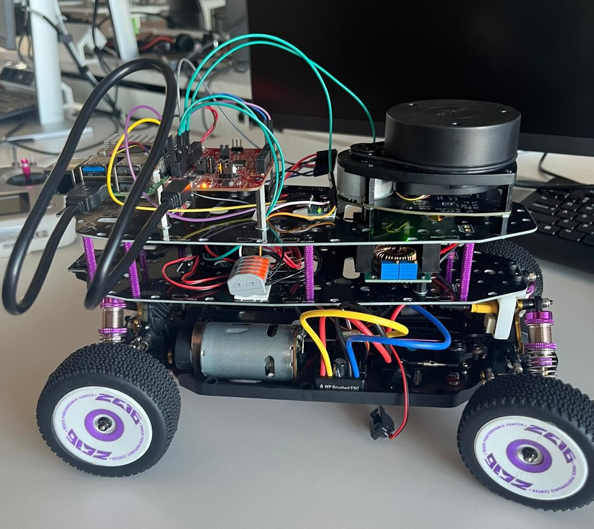
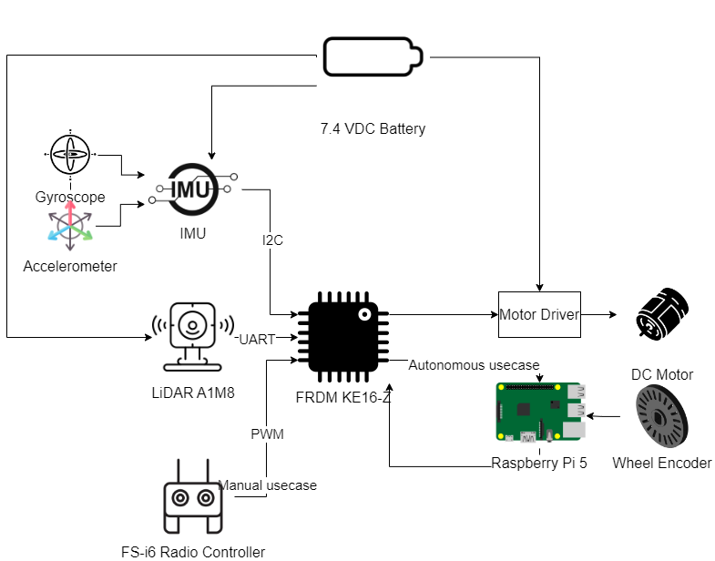

# Project Description
This is my Bachelor's Thesis project, Mapping Techniques using SLAM.

For this project, I have developed a four wheeled differential-drive robot equipped with:
- NXP FRDM KE-16Z development board
- Raspberry Pi 5
- RPLidar A1M8
- MPU 6050 Inertial Measurement Unit
- Wheel Encoder
- FlySky FS-i6 radio controller

 
<b>Final form of the robot</b></a>

# System Architecture
 
<b>System Architecture</b></a>

The system is powered by a 2S LiPo battery, limited with the use of a Step Down Buck converter. 
The data from the IMU (which consists of a gyroscope and an accelerometer), the Lidar and the radio controller is acquired using the NXP FRDM KE-16Z development board. This data is transmitted serially, using the UART Debug driver to the Raspberry Pi 5, where it is processed using ROS2. The wheel encoder data is read directly on this sensor as well. 
In the end, the robot can be controlled using the radio controller and after applying the SLAM algorithm, a map of the surrounding environment can be visualized using Rviz.

The IMU data is read using I2C and callibrated using the Magneto Software. The data is also filtered using a First Order IIR filter.
The Lidar data is acquired using UART.
The Radio Controller transmits a PWM signal that is received by the NXP dev board. The period of this signal is read using the FlexTimer module and the commands are passed on to the ESC and the servomotor, therefore moving forwards or backwards or steering left and right.
The wheel encoder transmits data to the Raspberry Pi 5, which reads the pulses and the elapsed time, calculating the speed using this data.

Four nodes are created in ROS: 
- SerialCommandService - which reads the serial data and further transmits the messages to the according nodes
- imu_data - handles the IMU data and publishes an IMU message
- lidar_data - handles the Lidar data and publishes a Point Cloud message
- wheel_encoder_data - handles the wheel encoder data and publishes an Odometry message

These messages are added to a custom Rviz configuration, where the map is finally visualized.

# Software Architecture
 
<b>Software Architecture</b></a>

## NXP FRDM KE-16Z development board
The NXP FRDM KE-16Z development board uses FreeRTOS for task scheduling.
The UART, I2C, GPIO, ADC and FlexTimer drivers are used here and the main applications are motor control, data acquiring (from the Lidar and IMU) and remote control.

## Raspberry Pi 5
The Operating System with which this board is equipped is Linux Ubuntu 24.04 LTS. 
It acquires Wheel Encoder data using the GPIO driver and uses USB for recieving the sensor data from the NXP development board serially. The applications developed on this board are data acquiring, publishing and subscribing using ROS, data visualization and the SLAM algorithm.

# Used Technologies
- C
- Python
- ROS2 (Jazzy Jalisco Distro)
- FreeRTOS
- Linux Ubuntu 24.04 LTS
- PlantUML
